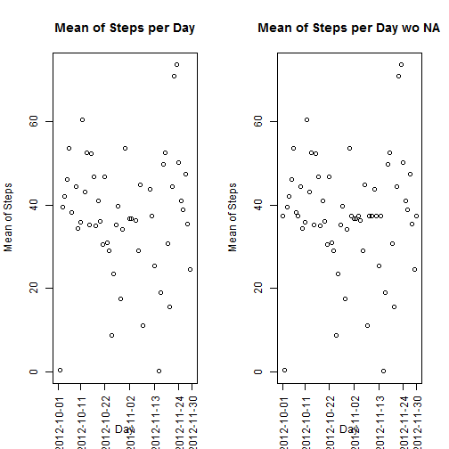

### Dont forget to Set Up the working directory

```r
# setwd("...Peer Assesment 1")
```
## 1. Loading and preprocessing the data
### 1.1 Loading the data - check file exists and if so load the data

```r
fich <- "activity.csv"
if (file.exists("activity.csv")) {
    
        activity <- read.csv(fich)
        str(activity)
        print("------------------------------------------")
        summary(activity)
        
} else {
     
    stop("File not found, can not read the data")
    
}
```

```
## 'data.frame':	17568 obs. of  3 variables:
##  $ steps   : int  NA NA NA NA NA NA NA NA NA NA ...
##  $ date    : Factor w/ 61 levels "2012-10-01","2012-10-02",..: 1 1 1 1 1 1 1 1 1 1 ...
##  $ interval: int  0 5 10 15 20 25 30 35 40 45 ...
## [1] "------------------------------------------"
```

```
##      steps                date          interval     
##  Min.   :  0.00   2012-10-01:  288   Min.   :   0.0  
##  1st Qu.:  0.00   2012-10-02:  288   1st Qu.: 588.8  
##  Median :  0.00   2012-10-03:  288   Median :1177.5  
##  Mean   : 37.38   2012-10-04:  288   Mean   :1177.5  
##  3rd Qu.: 12.00   2012-10-05:  288   3rd Qu.:1766.2  
##  Max.   :806.00   2012-10-06:  288   Max.   :2355.0  
##  NA's   :2304     (Other)   :15840
```

### 1.2 PreProccessing the data

```r
# Converting "date" attribute from factor to date
activity$date <- as.Date(activity$date)
# Remove those days without data, those days with all 288 intervals = NA
# daysNA <- tapply(is.na(activity$step), activity$date, sum) == 288
# daysNA <- as.Date(rownames(daysNA[daysNA]))
# activity <- subset(activity, ! (activity$date %in% daysNA))
# Checking clean data 
# summary(activity)
# str(activity)
```

## 2. What is mean total number of steps taken per day?
### 2.1 Make a histogram of the total number of steps taken each day

```r
SumStepsPerDay <- tapply(activity$steps, activity$date,  sum)
hist(SumStepsPerDay, breaks=20)
```

 

### 2.2 Report the mean and median total number of steps taken per day

```r
stepmean <- tapply(activity$steps, activity$date, mean)
stepmedian <- tapply(activity$steps, activity$date, median)
stepstats <- cbind(stepmean, stepmedian)
stepstats
```

```
##              stepmean stepmedian
## 2012-10-01         NA         NA
## 2012-10-02  0.4375000          0
## 2012-10-03 39.4166667          0
## 2012-10-04 42.0694444          0
## 2012-10-05 46.1597222          0
## 2012-10-06 53.5416667          0
## 2012-10-07 38.2465278          0
## 2012-10-08         NA         NA
## 2012-10-09 44.4826389          0
## 2012-10-10 34.3750000          0
## 2012-10-11 35.7777778          0
## 2012-10-12 60.3541667          0
## 2012-10-13 43.1458333          0
## 2012-10-14 52.4236111          0
## 2012-10-15 35.2048611          0
## 2012-10-16 52.3750000          0
## 2012-10-17 46.7083333          0
## 2012-10-18 34.9166667          0
## 2012-10-19 41.0729167          0
## 2012-10-20 36.0937500          0
## 2012-10-21 30.6284722          0
## 2012-10-22 46.7361111          0
## 2012-10-23 30.9652778          0
## 2012-10-24 29.0104167          0
## 2012-10-25  8.6527778          0
## 2012-10-26 23.5347222          0
## 2012-10-27 35.1354167          0
## 2012-10-28 39.7847222          0
## 2012-10-29 17.4236111          0
## 2012-10-30 34.0937500          0
## 2012-10-31 53.5208333          0
## 2012-11-01         NA         NA
## 2012-11-02 36.8055556          0
## 2012-11-03 36.7048611          0
## 2012-11-04         NA         NA
## 2012-11-05 36.2465278          0
## 2012-11-06 28.9375000          0
## 2012-11-07 44.7326389          0
## 2012-11-08 11.1770833          0
## 2012-11-09         NA         NA
## 2012-11-10         NA         NA
## 2012-11-11 43.7777778          0
## 2012-11-12 37.3784722          0
## 2012-11-13 25.4722222          0
## 2012-11-14         NA         NA
## 2012-11-15  0.1423611          0
## 2012-11-16 18.8923611          0
## 2012-11-17 49.7881944          0
## 2012-11-18 52.4652778          0
## 2012-11-19 30.6979167          0
## 2012-11-20 15.5277778          0
## 2012-11-21 44.3993056          0
## 2012-11-22 70.9270833          0
## 2012-11-23 73.5902778          0
## 2012-11-24 50.2708333          0
## 2012-11-25 41.0902778          0
## 2012-11-26 38.7569444          0
## 2012-11-27 47.3819444          0
## 2012-11-28 35.3576389          0
## 2012-11-29 24.4687500          0
## 2012-11-30         NA         NA
```

```r
plot(stepmean, cex.axis = 1, main="Mean of Steps per Day", 
                xlab="Day", ylab="Mean of Steps", xaxt="n")
axis(1, c(1,11,22,33,44,55,61), rownames(stepmean)[c(1,11,22,33,44,55,61)],
                las=2, cex.axis = 1)
```

 

## 3. What is the average daily activity pattern?
### 3.1 Make a time series plot (i.e. type = "l") of the 5-minute interval (x-axis) and the average number of steps taken, averaged across all days (y-axis)

```r
MeanStepsPerInterval <- tapply(activity$steps, activity$interval, mean, na.rm=TRUE)
xlabel <- "Interval of the day - From 00:00 to 23:55 in 5 minutes interval"
plot(MeanStepsPerInterval, main="Mean of Total Steps per Day Interval",
                type = "l", cex.axis = 1, xlab=xlabel)
```

 

### 3.2 Which 5-minute interval, on average across all the days in the dataset, contains the maximum number of steps?

```r
MeanStepsPerInterval[MeanStepsPerInterval == max(MeanStepsPerInterval)]
```

```
##      835 
## 206.1698
```

## 4. Imputing missing values
### 4.1 Calculate and report the total number of missing values in the dataset (i.e. the total number of rows with NAs)

```r
nrow(activity)-sum(complete.cases(activity))
```

```
## [1] 2304
```

### 4.2 Devise a strategy for filling in all of the missing values in the dataset. The  strategy does not need to be sophisticated. For example, you could use the mean or median for that day, or the mean for that 5-minute interval, etc.
### .
## Strategy will be apply the mean of interval
### .

### 4.3 Create a new dataset that is equal to the original dataset but with the missing data filled in.

```r
daysNA <- tapply(is.na(activity$step), activity$date, sum) == 288
daysNA <- as.Date(rownames(daysNA[daysNA]))
activity_wo_NA <- activity
for (day in daysNA) {
    activity_wo_NA$steps[activity_wo_NA$date == day] <- MeanStepsPerInterval
}
summary(activity_wo_NA)
```

```
##      steps             date               interval     
##  Min.   :  0.00   Min.   :2012-10-01   Min.   :   0.0  
##  1st Qu.:  0.00   1st Qu.:2012-10-16   1st Qu.: 588.8  
##  Median :  0.00   Median :2012-10-31   Median :1177.5  
##  Mean   : 37.38   Mean   :2012-10-31   Mean   :1177.5  
##  3rd Qu.: 27.00   3rd Qu.:2012-11-15   3rd Qu.:1766.2  
##  Max.   :806.00   Max.   :2012-11-30   Max.   :2355.0
```

### 4.4 Make a histogram of the total number of steps taken each day and Calculate and report the mean and median total number of steps taken per day. Do these values differ from the estimates from the first part of the assignment? What is the impact of imputing missing data on the estimates of the total daily number of steps?

```r
SumStepsPerDay_wo_NA <- tapply(activity_wo_NA$steps, activity_wo_NA$date,  sum)
par(mfrow=c(1,2))
hist(SumStepsPerDay_wo_NA, breaks=20, main="Hist - Total Steps Per Day")
hist(SumStepsPerDay, breaks=20, main="Hist- Total Steps Per Day - wo NA")
```

 

```r
# Report the mean and median total number of steps taken per day
```

```r
stepmean_wo_NA <- tapply(activity_wo_NA$steps, activity_wo_NA$date, mean)
stepmedian_wo_NA <- tapply(activity_wo_NA$steps, activity_wo_NA$date, median)
stepstats_wo_NA <- cbind(stepmean_wo_NA, stepmedian_wo_NA)
cbind(stepstats, stepstats_wo_NA)
```

```
##              stepmean stepmedian stepmean_wo_NA stepmedian_wo_NA
## 2012-10-01         NA         NA     37.3825996         34.11321
## 2012-10-02  0.4375000          0      0.4375000          0.00000
## 2012-10-03 39.4166667          0     39.4166667          0.00000
## 2012-10-04 42.0694444          0     42.0694444          0.00000
## 2012-10-05 46.1597222          0     46.1597222          0.00000
## 2012-10-06 53.5416667          0     53.5416667          0.00000
## 2012-10-07 38.2465278          0     38.2465278          0.00000
## 2012-10-08         NA         NA     37.3825996         34.11321
## 2012-10-09 44.4826389          0     44.4826389          0.00000
## 2012-10-10 34.3750000          0     34.3750000          0.00000
## 2012-10-11 35.7777778          0     35.7777778          0.00000
## 2012-10-12 60.3541667          0     60.3541667          0.00000
## 2012-10-13 43.1458333          0     43.1458333          0.00000
## 2012-10-14 52.4236111          0     52.4236111          0.00000
## 2012-10-15 35.2048611          0     35.2048611          0.00000
## 2012-10-16 52.3750000          0     52.3750000          0.00000
## 2012-10-17 46.7083333          0     46.7083333          0.00000
## 2012-10-18 34.9166667          0     34.9166667          0.00000
## 2012-10-19 41.0729167          0     41.0729167          0.00000
## 2012-10-20 36.0937500          0     36.0937500          0.00000
## 2012-10-21 30.6284722          0     30.6284722          0.00000
## 2012-10-22 46.7361111          0     46.7361111          0.00000
## 2012-10-23 30.9652778          0     30.9652778          0.00000
## 2012-10-24 29.0104167          0     29.0104167          0.00000
## 2012-10-25  8.6527778          0      8.6527778          0.00000
## 2012-10-26 23.5347222          0     23.5347222          0.00000
## 2012-10-27 35.1354167          0     35.1354167          0.00000
## 2012-10-28 39.7847222          0     39.7847222          0.00000
## 2012-10-29 17.4236111          0     17.4236111          0.00000
## 2012-10-30 34.0937500          0     34.0937500          0.00000
## 2012-10-31 53.5208333          0     53.5208333          0.00000
## 2012-11-01         NA         NA     37.3825996         34.11321
## 2012-11-02 36.8055556          0     36.8055556          0.00000
## 2012-11-03 36.7048611          0     36.7048611          0.00000
## 2012-11-04         NA         NA     37.3825996         34.11321
## 2012-11-05 36.2465278          0     36.2465278          0.00000
## 2012-11-06 28.9375000          0     28.9375000          0.00000
## 2012-11-07 44.7326389          0     44.7326389          0.00000
## 2012-11-08 11.1770833          0     11.1770833          0.00000
## 2012-11-09         NA         NA     37.3825996         34.11321
## 2012-11-10         NA         NA     37.3825996         34.11321
## 2012-11-11 43.7777778          0     43.7777778          0.00000
## 2012-11-12 37.3784722          0     37.3784722          0.00000
## 2012-11-13 25.4722222          0     25.4722222          0.00000
## 2012-11-14         NA         NA     37.3825996         34.11321
## 2012-11-15  0.1423611          0      0.1423611          0.00000
## 2012-11-16 18.8923611          0     18.8923611          0.00000
## 2012-11-17 49.7881944          0     49.7881944          0.00000
## 2012-11-18 52.4652778          0     52.4652778          0.00000
## 2012-11-19 30.6979167          0     30.6979167          0.00000
## 2012-11-20 15.5277778          0     15.5277778          0.00000
## 2012-11-21 44.3993056          0     44.3993056          0.00000
## 2012-11-22 70.9270833          0     70.9270833          0.00000
## 2012-11-23 73.5902778          0     73.5902778          0.00000
## 2012-11-24 50.2708333          0     50.2708333          0.00000
## 2012-11-25 41.0902778          0     41.0902778          0.00000
## 2012-11-26 38.7569444          0     38.7569444          0.00000
## 2012-11-27 47.3819444          0     47.3819444          0.00000
## 2012-11-28 35.3576389          0     35.3576389          0.00000
## 2012-11-29 24.4687500          0     24.4687500          0.00000
## 2012-11-30         NA         NA     37.3825996         34.11321
```

```r
par(mfrow=c(1,2))
plot(stepmean, cex.axis = 1, main="Mean of Steps per Day", 
                xlab="Day", ylab="Mean of Steps", xaxt="n")
axis(1, c(1,11,22,33,44,55,61), rownames(stepmean)[c(1,11,22,33,44,55,61)],
                las=2, cex.axis = 1)
plot(stepmean_wo_NA, cex.axis = 1, main="Mean of Steps per Day wo NA", 
                xlab="Day", ylab="Mean of Steps", xaxt="n")
axis(1, c(1,11,22,33,44,55,61), rownames(stepmean_wo_NA)[c(1,11,22,33,44,55,61)],
                las=2, cex.axis = 1)
```

 
#### .
#### NO impact on the mean, neither meadian, on days without NA originally, High impact on the median on days with original NA data
### .

### 5. Are there differences in activity patterns between weekdays and weekends?
### 5.1 Create a new factor variable in the dataset with two levels - "weekday" and "weekend" indicating whether a given date is a weekday or weekend day.

```r
dayofweek <- weekdays(activity$date)
weekend <- dayofweek == "sábado" | dayofweek == "domingo"
table(weekend)
```

```
## weekend
## FALSE  TRUE 
## 12960  4608
```

```r
weekend [weekend] <- "weekend"
weekend[weekend == FALSE] <- "weekday"
table((weekend))
```

```
## 
## weekday weekend 
##   12960    4608
```

```r
activity <- cbind(activity, weekend)
```

### 5.2 Make a panel plot containing a time series plot (i.e. type = "l") of the 5-minute interval (x-axis) and the average number of steps taken, averaged across all weekday days or weekend days (y-axis). 

```r
MeanStepsPerInterval_weekend <- tapply(activity$steps[activity$weekend == "weekend"], 
                                       activity$interval[activity$weekend == "weekend"],
                                       mean, na.rm=TRUE)
MeanStepsPerInterval_weekday <- tapply(activity$steps[activity$weekend == "weekday"], 
                                       activity$interval[activity$weekend == "weekday"],
                                       mean, na.rm=TRUE)

xlabel <- "Interval of the day - From 00:00 to 23:55 - 5 minutes"
par(mfrow=c(2,1))
plot(MeanStepsPerInterval_weekend, main="Mean Steps/Interval-Weekend",
                type = "l", cex.axis = 1, xlab="")

plot(MeanStepsPerInterval_weekday, main="Mean Steps/Interval-Weekday",
                type = "l", cex.axis = 1, xlab=xlabel)
```

 


